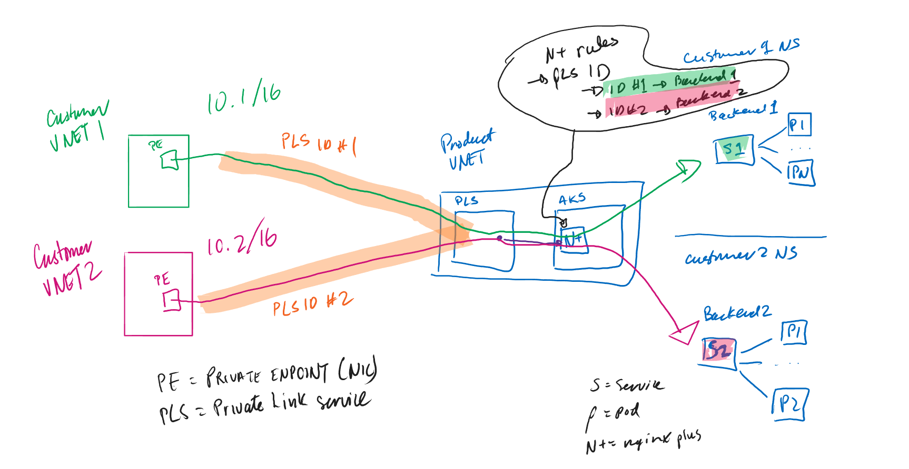

# AKS Multitenant Private Link

Creating Multi-tenanted services in AKS using Azure Private Link Service and TCP Protocol v2 link identifiers 

## Problem Statement

## Solution

- leverage (TCP Proxy Protocol v2 TLV from Azure Private Link Service)[https://learn.microsoft.com/en-us/azure/private-link/private-link-service-overview#getting-connection-information-using-tcp-proxy-v2]
- use Nginx Plus Ingress controller:
    - use annotations to extract the customer specific Private Link ID (PLID)
    - use this ID to create/map PLID to Backend Service (Customer Specific Service/Deployment)

- Customer 1 has a Private Endpoint (PE) which is connected to the Private Link Service in the "Product VNET"
    - This connection has PLID = "1"
- Customer 2 has a Private Endpoint (PE) which is connected to the Private Link Service in the "Product VNET"
    - This connection has PLID = "2"
- PLS will pass PLID to TCP Proxy Protocol v2 aware Ingress Controller (e.g. Nginx Plus)
- Ingress Controller should:
    - be able to parse/caputre the customer specific PLID
    - be able to route traffic to customer specific instance of Product application (e.g. "Managed Database") based on PLID
        - e.g. PLID #1 will have traffic proxied to Backend #1 ("Managed Database" Backend Service #1 in AKS)
        - e.g. PLID #2 will have traffic proxied to Backend #2 ("Managed Database" Backend Service #2 in AKS)
- Customer CIDR/VNET IP address are not used to route traffic - only PLIDs

